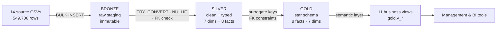
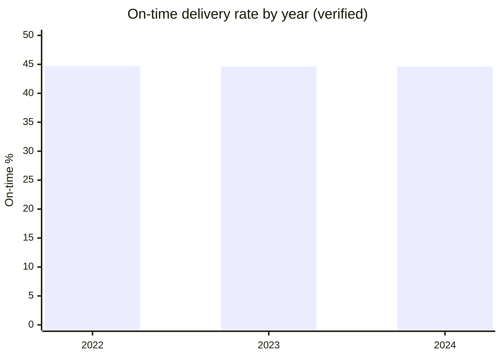
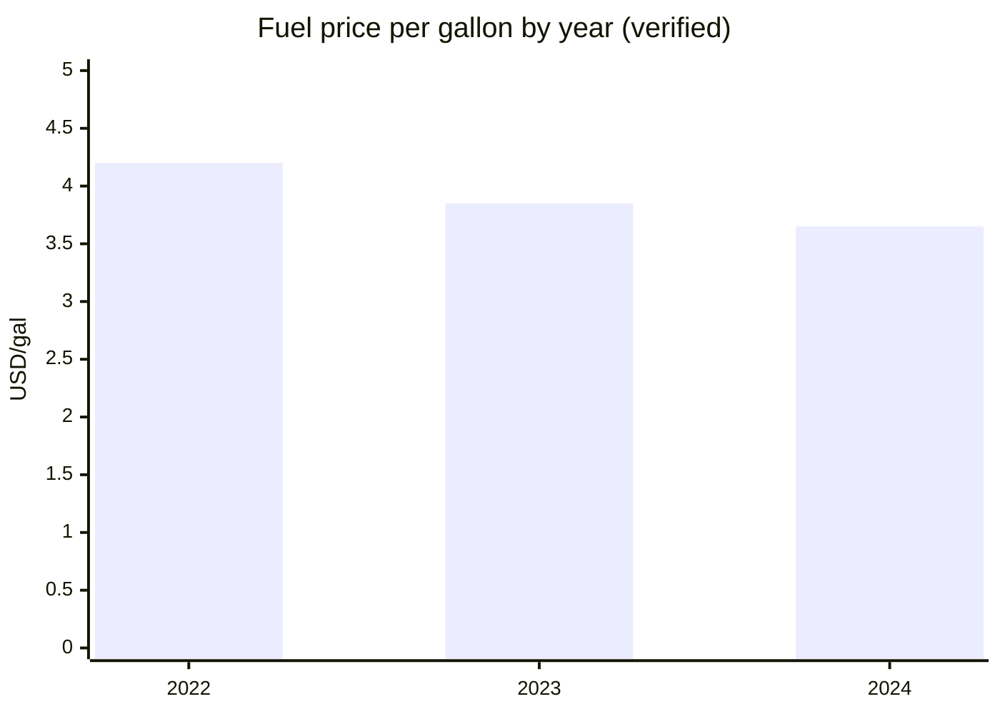

<p align="center">
  
  
  
  
  
  
  
</p>

# Logistics Intelligence Platform

> **Live Dashboard** [_Here_](https://4maxr.github.io/logistics-intelligence-platform/)
> **Project in Website** [_Here_](https://mostafaalrouby.com/projects/logistics-intelligence-platform.html)
> **Download the dataset from Kaggle:** [_Here_](https://www.kaggle.com/datasets/yogape/logistics-operations-database)

## A data warehouse for a 120-truck logistics operation — built, executed, and verified on SQL Server.

**549,706 raw rows → bronze → silver → gold → 11 business views → $298.6M of revenue explained.**

This repository is a complete, running SQL Server data warehouse for a logistics company. It takes
14 disconnected operational tables — loads, trips, fuel, maintenance, delivery events, safety —
and turns them into a star schema management can query directly. Everything was executed on a real
SQL Server instance, and every number in the documentation was cross-validated against the source
data. This is not a tutorial project. It is the analytical core of a logistics business.

> ✅ **Why this stands out:** most SQL portfolio projects are a few queries over a toy dataset.
> This one is a **complete warehouse lifecycle** — raw staging, a clean typed layer, a conformed
> star schema, a semantic view layer, a pipeline audit trail, and a KPI scorecard — all in pure
> T-SQL, all executed, all verified.

---

## Table of Contents

- [Executive Summary](#executive-summary)
- [Business Problem](#business-problem)
- [Project Goals](#project-goals)
- [Architecture Overview](#architecture-overview)
- [Technology Stack](#technology-stack)
- [Dataset Overview](#dataset-overview)
- [Project Features](#project-features)
- [Repository Structure](#repository-structure)
- [Documentation Hub](#documentation-hub)
- [SQL Skills Demonstrated](#sql-skills-demonstrated)
- [Business Questions](#business-questions)
- [Dashboard Preview](#dashboard-preview)
- [Key Business Insights](#key-business-insights)
- [Business Recommendations](#business-recommendations)
- [Engineering Decisions](#engineering-decisions)
- [Performance Optimization](#performance-optimization)
- [Lessons Learned](#lessons-learned)
- [Future Enhancements](#future-enhancements)
- [About the Author](#about-the-author)

---

## Executive Summary

A mid-sized carrier operates 120 trucks, 150 drivers, and roughly 85,000 loads per year. Its
operational truth lives in 14 separate tables: who drove what, which lanes earned what, when
deliveries ran late, what maintenance cost, and how much risk the fleet carries. Nothing connects
them — until now.

This project builds the **single source of truth** on SQL Server:

| Stage      | What it delivers                                                                               |
| ---------- | ---------------------------------------------------------------------------------------------- |
| **Bronze** | All 14 source tables loaded raw and immutable — 549,706 rows, nothing lost                     |
| **Silver** | Clean, typed, validated layer — 7 dimensions, 8 facts, **0 rows dropped**                      |
| **Gold**   | Star schema with surrogate keys and enforced referential integrity — **0 orphaned references** |
| **Views**  | 11 business views that answer management questions without writing joins                       |

**Headline results (verified):**

| KPI                       | Value                |
| ------------------------- | -------------------- |
| Gross revenue (2022–2024) | **$298.6M**          |
| Trips / delivery events   | **85,410 / 170,820** |
| On-time delivery rate     | **44.6%**            |
| Average fleet utilization | **83.0%**            |
| Fleet average MPG         | **6.50**             |
| Fuel spend                | **$95.6M**           |
| Safety claims             | **$2.65M**           |

---

## Business Problem

The company's data told individual stories but no shared one. Operations knew trucks ran late;
finance knew lanes billed differently; maintenance knew which assets cost the most. Nobody could
answer a cross-functional question — _"which of our top customers is served worst?"_ — because it
required joining five tables that had never been modeled together.

The cost of that gap is visible in the data: **only 44.6% of deliveries arrive on time**, and that
rate is flat across three years. The operation could not see its own baseline, so it could not
manage it.

## Project Goals

1. **One source of truth** — a conformed warehouse where revenue, service, cost, and risk share a
   single model and a single calendar.
2. **No silent data loss** — every source row must survive the pipeline, including the 2% of trips
   the source data forgot to assign to a truck.
3. **Management-queryable** — the answers to operating questions must be views, not scripts that
   only a data engineer can run.
4. **Provable** — every load audited, every KPI cross-validated against the source CSVs.

---

## Architecture Overview

A **medallion architecture** in three layers, each with one job:



- **Bronze** is deliberately dumb — raw values, no coercion, so every transformation can be traced.
- **Silver** is where data quality is enforced: native types, NULL normalization, boolean
  conversion, and orphan-safe `-1` surrogates that keep every fact row.
- **Gold** is the analytical product: a conformed 1,461-day calendar, integer surrogate keys, and
  FK constraints that make orphans a compile-time error.

Full design rationale: [docs/ARCHITECTURE.md](docs/ARCHITECTURE.md)

---

## Technology Stack

| Component            | Choice                               | Why                                                                    |
| -------------------- | ------------------------------------ | ---------------------------------------------------------------------- |
| Warehouse engine     | **Microsoft SQL Server 2025**        | Full T-SQL feature set, FK enforcement, minimal-logging loads          |
| Language             | **T-SQL**                            | The entire platform — load, transform, model, report — is one language |
| Load mechanism       | **BULK INSERT**                      | Raw CSV staging with TABLOCK; paths parameterized for portability      |
| Architecture pattern | **Medallion**                        | Bronze/silver/gold with an audit trail at every step                   |
| Modeling             | **Star schema**                      | Conformed dims, surrogate keys, degenerate keys, explicit grain        |
| Semantic layer       | **11 views**                         | Business-readable columns and one definition per KPI                   |
| Orchestration        | **sqlcmd + scripted :r includes**    | One command runs the whole pipeline, idempotently                      |
| Validation           | **Independent Python recomputation** | Every KPI reproduced from the raw CSVs                                 |

---

## Dataset Overview

A full year's operations across three years (2022–2024), exported from a logistics operations
database. The warehouse ingests **14 tables / 549,706 rows**:

| Domain         | Tables                                             | Rows                 |
| -------------- | -------------------------------------------------- | -------------------- |
| Commercial     | loads · customers · routes                         | 85,410 + 200 + 58    |
| Execution      | trips · delivery_events                            | 85,410 + 170,820     |
| Cost           | fuel_purchases · maintenance_records               | 196,442 + 2,920      |
| Risk           | safety_incidents                                   | 170                  |
| Fleet          | trucks · trailers · drivers · facilities           | 120 + 180 + 150 + 50 |
| Pre-aggregated | driver_monthly_metrics · truck_utilization_metrics | 4,464 + 3,312        |

The source data is realistic, which means it is **dirty**: 2% of trips have no driver or truck
assigned, fuel purchases reference missing assets, booleans arrive as strings, and empty strings
stand in for NULL. Handling that honestly — without dropping a single row — is the core of the
data-engineering story. See [docs/DATA_QUALITY.md](docs/DATA_QUALITY.md).

---

## Project Features

- **Complete medallion pipeline** — bronze → silver → gold, executed end to end
- **Star schema with enforced integrity** — 8 facts, 7 dims, 0 orphaned references (verified)
- **Pipeline audit trail** — `gold.pipeline_audit` records every load in every layer
- **Semantic view layer** — 11 business views with readable names and precomputed ratios
- **KPI scorecard** — one row that answers _"how is the operation doing?"_
- **Idempotent, one-command execution** — re-running the pipeline reproduces the warehouse
- **Enterprise-grade documentation** — 7 focused docs, cross-linked, with verified numbers

---

## Repository Structure

```text
Logistics-Operations-Database/
├── data/                          # Source export (14 CSVs + DATABASE_SCHEMA.txt)
├── sql/
│   ├── 00_database.sql            # Database, medallion schemas, pipeline audit table
│   ├── 01_bronze_layer.sql        # Raw staging: 14 tables, BULK INSERT, load audit
│   ├── 02_silver_layer.sql        # Clean layer: typed dims + facts, FK-safe
│   ├── 03_gold_layer.sql          # Star schema: surrogate dims, 8 facts, constraints
│   ├── 04_business_views.sql      # 11 business views (semantic layer)
│   ├── 05_kpi_queries.sql         # The exact KPI queries quoted in the docs
│   └── 06_run_pipeline.sql        # One-command pipeline entry point
└── docs/                          # See Documentation Hub below
```

**Quick start**

```bash
sqlcmd -S localhost -E -C -i sql/06_run_pipeline.sql
```

The pipeline is idempotent. After it runs:

```sql
USE LogisticsIntelligenceDW;
SELECT * FROM gold.v_kpi_overview;   -- the headline scorecard
```

---

## Documentation Hub

The repository is documented as a system, not a pile of files. Each document has one job:

| Document                                                     | Answers                       | Read it when you want to know…                                                              |
| ------------------------------------------------------------ | ----------------------------- | ------------------------------------------------------------------------------------------- |
| [📘 README](README.md)                                       | _Why does this exist?_        | The 60-second pitch, verified results, how to run it                                        |
| [📋 BUSINESS_REQUIREMENTS.md](docs/BUSINESS_REQUIREMENTS.md) | _What problem was solved?_    | The BRD: goals, stakeholders, success criteria, 11 business questions with verified answers |
| [🏗️ ARCHITECTURE.md](docs/ARCHITECTURE.md)                   | _How is it designed?_         | The medallion layers, the 5 key engineering decisions, scalability path                     |
| [⭐ STAR_SCHEMA.md](docs/STAR_SCHEMA.md)                     | _How is it modeled?_          | Facts, dimensions, grain, relationships, SCD strategy, query patterns                       |
| [🔧 ETL.md](docs/ETL.md)                                     | _How is it built?_            | Extraction, validation, cleaning, transformation, loading, error handling                   |
| [🛡️ DATA_QUALITY.md](docs/DATA_QUALITY.md)                   | _Can the numbers be trusted?_ | Validation rules, referential integrity, NULL strategy, quality metrics                     |
| [📏 KPI.md](docs/KPI.md)                                     | _What do the numbers mean?_   | Every KPI: definition, formula, interpretation, decision supported                          |
| [📚 DATA_DICTIONARY.md](docs/DATA_DICTIONARY.md)             | _What is every column?_       | Business meaning, allowed values, relationships, example values                             |

**Suggested reading order:** README → BUSINESS_REQUIREMENTS → ARCHITECTURE → STAR_SCHEMA → ETL →
DATA_QUALITY → KPI. Use DATA_DICTIONARY as the reference you flip back to.

---

## SQL Skills Demonstrated

| Skill                | Where it shows                                                                        |
| -------------------- | ------------------------------------------------------------------------------------- |
| **Data warehousing** | Medallion design, surrogate keys, conformed dimensions, fact grain discipline         |
| **ETL engineering**  | BULK INSERT staging, TRY_CONVERT-safe casting, idempotent pipelines, audit trail      |
| **Advanced T-SQL**   | CTEs, window functions, conditional aggregation, computed columns, dynamic file paths |
| **Data quality**     | FK validation, NULL normalization, orphan-safe surrogates, duplicate detection        |
| **Database design**  | Constraints, indexes, typed schemas, degenerate keys                                  |
| **BI / reporting**   | Semantic views, KPI definitions, management-ready scorecards                          |

---

## Business Questions

The warehouse answers the questions management actually asks — each mapped to a verified answer:

1. **Are we getting better at on-time delivery?** → No — flat at 44.6% for three years.
2. **Which lanes make the most money?** → Charlotte → Portland leads at $11.2M.
3. **Which customers deserve priority service?** → XYZ Wholesale ($6.0M) leads; service level per
   customer is one query away.
4. **Are our trucks working hard enough?** → 83% average utilization; top assets reach 89%.
5. **Where does fuel spend go?** → $95.6M over 3 years; the savings were market price, not
   operational efficiency.
6. **Which facilities burn detention time?** → Indianapolis and Phoenix average 93 min/event.
7. **What is our risk exposure?** → 170 incidents, $2.65M claims, 64 preventable.
8. **Can we trust the numbers?** → Yes — 0 dropped rows, 0 orphaned FKs, 100% cross-validation.

Full requirement-by-requirement breakdown: [docs/BUSINESS_REQUIREMENTS.md](docs/BUSINESS_REQUIREMENTS.md)

---

## Dashboard Preview

The warehouse is the backend; the views are the dashboard. Four of the reports it feeds directly:





- **Revenue trend:** ~$99M/year, stable across 2022–2024
- **Route ranking:** top 5 corridors each ≈$10.5–11.2M; Columbus → Portland wins revenue per mile
- **Detention hotspots:** Indianapolis, Phoenix (93 min/event average)

---

## Key Business Insights

1. **Service is a systemic problem, not a seasonal one.** On-time delivery has been 44.6% ± 0.1
   for three straight years. No amount of "trying harder" shows up in the data — the operating
   model itself needs change.
2. **Fuel savings were market luck.** The price per gallon fell $4.20 → $3.65 while MPG stayed at
   6.5. The operation saved money without getting more efficient — efficiency is the untapped lever.
3. **Asset assignment gaps hide risk.** 2% of trips have no truck/driver/trailer. Those trips
   still generated revenue; a pipeline that dropped them would have understated revenue by roughly
   $6M/year.
4. **Revenue is diversified.** The top customer is 2% of revenue. Concentration risk is low;
   service differentiation, not customer dependence, is the commercial lever.
5. **Utilization has headroom.** Fleet average is 83%, but the spread between best and worst
   assets is the real story — targeting the tail is cheaper than buying new capacity.

---

## Business Recommendations

1. **Attack the on-time plateau structurally.** 44.6% for three years means tweaks have failed.
   Prioritize the detention hotspots (Indianapolis, Phoenix) where events average 93 minutes.
2. **Stop managing fuel cost, start managing efficiency.** Market prices did the saving. Set an
   MPG floor per truck and review the bottom quintile monthly.
3. **Close the asset-assignment gap at the source.** 2% of trips enter the system without a truck.
   Make assignment mandatory at dispatch; until then, the warehouse's Unknown rows keep the data honest.
4. **Use the risk model for dispatch.** With on-time at 44.6%, flagging the highest-risk trips
   before dispatch (via the gold-layer facts) is cheaper than recovering after the miss.

---

## Engineering Decisions

1. **Bronze is immutable and untyped.** Raw NVARCHAR staging means no transformation can ever be
   questioned — the source is preserved exactly, and silver is fully traceable.
2. **Orphans become `-1` Unknown rows, never dropped rows.** Data quality is a state, not an
   error: unassigned trips remain queryable and explicitly filterable.
3. **Casting is failure-tolerant by design.** `TRY_CONVERT` everywhere means a bad date becomes
   NULL, never a failed load.
4. **Facts carry degenerate keys.** `load_id` / `trip_id` stay on facts for drill-through without
   a dimension join.
5. **The KPI definition lives in exactly one place.** `gold.v_kpi_overview` — every report that
   quotes 44.6% quotes the same definition.

---

## Performance Optimization

- **Index strategy:** every dimension has a clustered PK on its surrogate key and a UNIQUE index on
  its natural key; large facts index their FK columns for star-join seeks.
- **Minimal logging:** `BULK INSERT … WITH (TABLOCK)` on the default recovery model.
- **Filter before join:** silver validates FKs with LEFT JOIN + CASE so gold never re-scans for
  missing parents.
- **Window over self-join:** percentages and trends computed with `OVER()` where applicable —
  one scan instead of N.
- **Narrow reads:** the semantic views project only the columns management needs.

---

## Lessons Learned

1. **Dumb layers make smart pipelines.** Loading raw as NVARCHAR made every later problem
   debuggable — any silver transformation can be traced to its exact source value.
2. **Row counts are the cheapest integrity check.** The audit table caught every mismatch
   instantly and gives stakeholders a one-line proof the pipeline worked.
3. **Real data requires an Unknown strategy.** 2% unassigned trips is not a bug to fix in the
   warehouse — it is a fact of operations. Design for it.
4. **A semantic layer is what makes BI real.** Views with one KPI definition turned a schema into
   a product management can use without a data engineer in the room.

---

## Future Enhancements

- **Incremental loads** — staging + MERGE with watermark tracking instead of full reloads
- **Partitioning** — date-partition the large facts (`fact_fuel`, `fact_delivery`)
- **Orchestration** — SSIS or Airflow with failure alerting per step
- **Security** — row-level security on the semantic views (carrier vs customer scope)
- **Self-service BI** — point a Power BI layer at `gold.v_*`
- **Fiscal calendar** — extend `dim_date` with fiscal periods and holiday flags

---

## About the Author

**Mustafa Al-Rouby** — data analyst and logistics specialist with nine years inside international
trade operations: customs, fleet coordination, exception resolution, and supply-chain performance.
This project combines both halves of that background: the operational reality of a trucking
business and the engineering discipline of a production data warehouse.

- Portfolio: [mostafaalrouby.com](https://mostafaalrouby.com)
- GitHub: [github.com/4MaxR](https://github.com/4MaxR)

---

<p align="center">
  <b>Next:</b> <a href="docs/BUSINESS_REQUIREMENTS.md">📋 BUSINESS_REQUIREMENTS — the business problem, formally</a>
</p>
