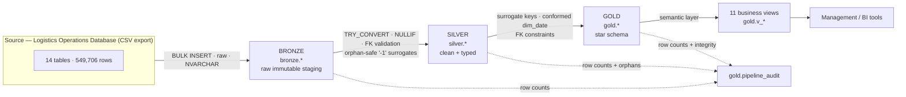

# Architecture

**Scope:** how the warehouse is designed, why the medallion pattern was chosen, what each layer
does, and how the design scales. For the business rationale, see
[BUSINESS_REQUIREMENTS.md](BUSINESS_REQUIREMENTS.md). For the modeling details, see
[STAR_SCHEMA.md](STAR_SCHEMA.md).

---

## 1. System Overview

The pipeline is **one command** (`sqlcmd -i sql/06_run_pipeline.sql`), **idempotent** (every script
drops and recreates its own targets), and **audited** (every load is recorded in
`gold.pipeline_audit`).

---

## 2. Why Medallion Architecture

The medallion pattern (bronze → silver → gold) was chosen over loading straight into a star schema
for four reasons:

| Reason | What it buys |
|---|---|
| **Traceability** | Every value in gold can be traced to its raw bronze record — nothing is transformed in place and lost |
| **Fault isolation** | A bad source value fails in silver where it can be seen and reported, never during load |
| **Reusability** | Silver is a clean, typed dataset independent of the final model — a different modeling choice later costs one layer, not the source |
| **Trust** | Each layer ends with an audit row and an integrity check; stakeholders can verify the pipeline at every boundary |

The alternative — ETL straight into a star schema — is faster to build and impossible to debug
at scale. For a warehouse whose job is to be *believed*, the extra layer is the point.

---

## 3. Layer-by-Layer

### 3.1 Bronze — raw, immutable, deliberately dumb

**Job:** preserve the source exactly.

- All 14 CSVs loaded via `BULK INSERT` with `TABLOCK`, `FIRSTROW = 2`,
  `ROWTERMINATOR = '0x0a'` (LF — verified in the source files).
- Every column is `NVARCHAR`. **No casting, no trimming, no filtering at load time.**
- Load paths are parameterized (`@data_dir`) so moving the repo changes one value.

**Why untyped?** A bad date or number can never fail the load — it lands as text and fails
visibly in silver, where it belongs. Bronze is the court of record; it does not judge.

**Verified:** 14 tables, 549,706 rows — byte-identical row counts to the source CSVs.

### 3.2 Silver — clean, typed, validated

**Job:** turn raw text into trustworthy typed data.

| Transformation | Mechanism |
|---|---|
| Type casting | `TRY_CONVERT` → native types (DATE, DECIMAL, INT, BIT, DATETIME2(0)) |
| Empty-string normalization | `NULLIF(LTRIM(RTRIM(col)), '')` → NULL |
| Boolean conversion | `CASE WHEN flag = 'True' THEN 1 ELSE 0` → BIT |
| Date truncation | fuel `purchase_date` → `LEFT(col, 10)` → DATE |
| FK validation | LEFT JOIN against source dims; missing parents → `'-1'` Unknown |
| Duplicate detection | PK-duplicate scan on every table (result: 0 duplicates) |

**The orphan policy:** facts never drop rows. A trip with no truck in the source becomes a trip
with `truck_id = '-1'` — present, joinable, and explicitly filterable
(`WHERE truck_sk > 0`). This is a *state*, not an error. Full accounting:
[DATA_QUALITY.md](DATA_QUALITY.md#3-referential-integrity).

**Verified:** 7 dims + 8 facts, 551,167 rows (the +1,461 delta vs bronze is the generated
calendar dimension), 0 rows dropped.

### 3.3 Gold — star schema + semantic layer

**Job:** the analytical product.

- Dimensions rebuilt with `INT IDENTITY` surrogate keys; the `-1` Unknown row is inserted first so
  it always gets the lowest SK.
- `dim_date` (1,461 days, 2022-01-01 → 2025-12-31) is the one conformed calendar shared by every fact.
- Facts carry FK constraints to dims — an orphaned reference is a compile-time error, not a
  runtime surprise.
- 11 views wrap the schema with business-readable names and precomputed ratios.

**Verified:** 30 objects; the 8-point referential-integrity check returns **0 orphans**.

---

## 4. Technology Stack

| Component | Choice | Rationale |
|---|---|---|
| Engine | Microsoft SQL Server 2025 Express (17.0) | Full T-SQL, FK enforcement, minimal-logging loads |
| Language | T-SQL | Load, transform, model, and report in one language |
| Load | `BULK INSERT` (TABLOCK) | Simple, fast, auditable; paths parameterized |
| Orchestration | `sqlcmd` + scripted `:r` includes | One command, idempotent, no extra tooling |
| Modeling | Star schema | See [STAR_SCHEMA.md](STAR_SCHEMA.md) |
| Validation | Independent Python recomputation | Cross-checks every KPI against the source CSVs |

---

## 5. Performance Considerations

- **Indexes:** every dim has a clustered PK on its surrogate key + a UNIQUE index on its natural
  key; facts index FK columns for star-join seeks.
- **Minimal logging:** `TABLOCK` on the default recovery model.
- **Filter before join:** silver validates FKs with LEFT JOIN + CASE so gold never re-scans for
  missing parents.
- **Window over self-join:** percentages/trends use `OVER()` where applicable — one scan, not N.
- **Narrow reads:** the semantic views project only the columns management needs.
- **SARGable predicates:** joins and filters use surrogate keys and date keys, never functions
  wrapped around indexed columns.

---

## 6. Scalability Path

The same pattern scales without redesign:

1. **Row volume** — partition the large facts (`fact_fuel`, `fact_delivery`) by `date_sk`;
   switch to `bcp`/`OPENROWSET` + staging + `MERGE` for incremental loads.
2. **Refreshes** — wrap each layer in a transaction; extend `pipeline_audit` with
   `started_at/finished_at/duration` (columns already reserved in the schema).
3. **Multi-tenant** — add row-level security on the semantic views; the model itself is unchanged.
4. **More sources** — new sources enter as new bronze tables, are conformed in silver, and join
   the existing conformed dims — no gold-layer remodel required.
5. **Scale-out** — the scripts are edition-agnostic; the same pipeline runs on Standard/Enterprise
   with partitioning and columnstore options enabled.

---

  <b>Previous:</b> <a href="BUSINESS_REQUIREMENTS.md">📋 BUSINESS_REQUIREMENTS</a> ·
  <b>Next:</b> <a href="STAR_SCHEMA.md">⭐ STAR_SCHEMA</a> ·
  <b>Back to:</b> <a href="../README.md#documentation-hub">Documentation Hub</a>

  <b>Related:</b> <a href="ETL.md">🔧 ETL pipeline</a> · <a href="DATA_QUALITY.md">🛡️ Data quality</a>

