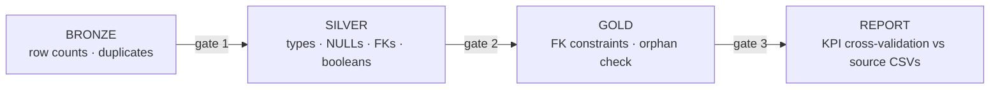

# Data Quality

**Scope:** the quality framework — validation rules, referential integrity, duplicate detection,
NULL strategy, business rules, profiling results, metrics, and known limitations. How these
checks run in the pipeline: [ETL.md](ETL.md).

---

## 1. Quality Framework

Quality is enforced at three boundaries:

Every gate produces auditable evidence in `gold.pipeline_audit`. Nothing is asserted — everything
is counted.

---

## 2. Validation Rules

| Rule | Applies to | Enforcement |
|---|---|---|
| Row count matches source | all 14 bronze tables | audit row per table after load |
| No duplicate natural keys | loads, trips, events, fuel, drivers, trucks | PK-duplicate scan pre-build; PK constraints post-build |
| Required keys never empty | loads.customer_id, loads.route_id, trips.load_id, events.* | FK scan — **all 0 missing** |
| Empty strings are NULL | every string column | `NULLIF(LTRIM(RTRIM(col)), '')` |
| Booleans are BIT | on_time_flag, at_fault_flag, injury_flag, preventable_flag | explicit CASE conversion |
| Dates parse or become NULL | every date column | `TRY_CONVERT(DATE)` |
| Facts reference existing dims | every fact in gold | FK constraints + 8-point orphan check |
| Numeric measures cast safely | every DECIMAL/INT column | `TRY_CONVERT` |

---

## 3. Referential Integrity

The source export is a normalized OLTP model, and **most FKs are clean**. The pipeline verifies
every one rather than assuming it:

| Fact → parent | Rows referencing missing parent | Handling |
|---|---|---|
| trips → loads | **0** | — |
| trips → drivers | **1,714** (2.0%) | `-1` Unknown driver |
| trips → trucks | **1,672** (2.0%) | `-1` Unknown truck |
| trips → trailers | **1,680** (2.0%) | `-1` Unknown trailer |
| fuel_purchases → trips | **0** | — |
| fuel_purchases → trucks | **3,880** | `-1` Unknown truck |
| fuel_purchases → drivers | **3,988** | `-1` Unknown driver |
| delivery_events → trips/loads/facilities | **0 / 0 / 0** | — |
| maintenance → trucks | **0** | — |
| incidents → trips/trucks/drivers | **0** | — |

**Gold-layer result: 0 orphaned references across all 8 checks.**

> ✅ **Why this matters:** those 1,672 "no truck" trips are completed trips that generated
> revenue. Dropping them would understate revenue by roughly **$6M/year**. The warehouse keeps
> them and makes the unassigned population explicit (`WHERE truck_sk > 0` to exclude).

---

## 4. Duplicate Detection

| Table | Duplicate natural keys |
|---|---|
| loads (load_id) | 0 |
| trips (trip_id) | 0 |
| delivery_events (event_id) | 0 |
| fuel_purchases (fuel_purchase_id) | 0 |
| drivers (driver_id) | 0 |
| trucks (truck_id) | 0 |

The check runs against bronze before any transformation, and PK constraints would reject
duplicates in silver/gold if new ones appeared.

---

## 5. NULL Strategy

| Pattern | Strategy |
|---|---|
| Missing *attribute* (e.g. termination_date) | NULL — correct: the driver is still employed |
| Missing *identifier* (e.g. trip without truck) | `-1` Unknown surrogate — the row must survive |
| Missing *measure* (e.g. blank revenue) | NULL — excluded from aggregations naturally |
| Aggregate protection | `NULLIF(denominator, 0)` everywhere division is used |

The rule: **attributes may be NULL, facts may not be dropped.** Unknown is a first-class value,
not an error.

---

## 6. Business Rules

| Rule | Definition |
|---|---|
| Gross revenue | `revenue + fuel_surcharge + accessorial_charges` (computed column) |
| On-time delivery | delivery events only, `on_time_flag = 1` — pickups are tracked but not scored |
| Utilization % | source `utilization_rate` (0–1 ratio) × 100 |
| Revenue per mile | `gross_revenue / NULLIF(distance, 0)` |
| Cost per mile | `maintenance cost / NULLIF(trip miles, 0)` |
| Active assets | `is_active` computed from status/employment fields |

Each rule is defined once in the gold layer and reused by every view — a KPI has exactly one
definition (see [KPI.md](KPI.md)).

---

## 7. Data Profiling (verified)

| Metric | Value |
|---|---|
| Source rows loaded (bronze) | 549,706 across 14 tables |
| Silver objects | 15 (7 dims + 8 facts) |
| Gold objects | 30 (7 dims + 8 facts + 11 views + audit) |
| Rows dropped by the pipeline | **0** |
| Orphaned gold references | **0** |
| Duplicate source keys | **0** |
| Trips missing driver / truck / trailer | 1,714 / 1,672 / 1,680 (→ Unknown) |
| Fuel purchases missing truck / driver | 3,880 / 3,988 (→ Unknown) |
| Cross-validation vs source CSVs | **100% KPI match** |

---

## 8. Known Limitations

Honest boundaries of the current build:

1. **SCD Type 1 only.** Dimensions hold the latest state; historical attribute changes (a driver
   moving terminals) are not versioned yet. Planned: Type 2 for driver/truck — see
   [STAR_SCHEMA.md](STAR_SCHEMA.md#6-slowly-changing-dimensions-scd).
2. **No dedup across sources.** Duplicates are checked *within* each table; cross-table identity
   resolution (e.g. the same facility listed twice) is not performed — the source defines the keys.
3. **The 2% unassigned population is preserved but not repaired.** The warehouse cannot invent a
   truck for a trip; it flags the gap. Closing it is a source-side (dispatch) fix.
4. **`utilization_rate` can exceed 1.0** in the source (over-utilization). The view scales it to
   % as-is; values above 100% are valid and meaningful.
5. **Partial 2025 data** exists in the source (77 delivery events, 25k fuel gallons). Queries
   should filter by year unless the full-year 2022–2024 window is intended.
6. **No row-level security** — the semantic views are open to any warehouse login. Planned with
   the multi-tenant roadmap ([ARCHITECTURE.md](ARCHITECTURE.md#6-scalability-path)).

---

  <b>Previous:</b> <a href="ETL.md">🔧 ETL</a> ·
  <b>Next:</b> <a href="KPI.md">📏 KPI</a> ·
  <b>Back to:</b> <a href="../README.md#documentation-hub">Documentation Hub</a>

  <b>Related:</b> <a href="KPI.md">📏 KPI definitions</a> · <a href="DATA_DICTIONARY.md">📚 Data dictionary</a>

