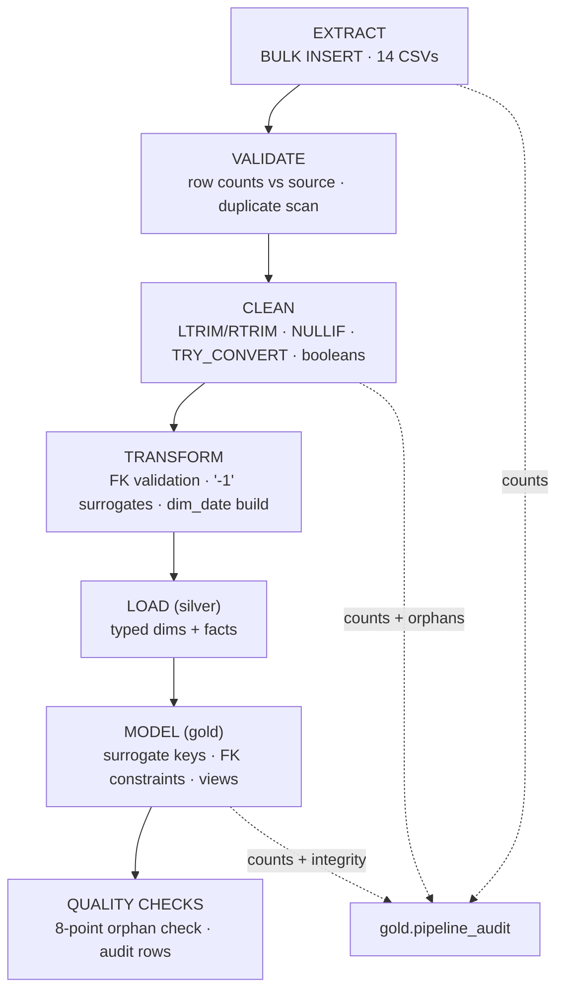

# ETL Documentation

**Scope:** the complete pipeline lifecycle — extraction, validation, cleaning, transformation,
loading, quality checks, error handling, and the incremental-load roadmap. Design rationale:
[ARCHITECTURE.md](ARCHITECTURE.md). Integrity results: [DATA_QUALITY.md](DATA_QUALITY.md).

---

## 1. Pipeline Overview



One command executes the whole thing, idempotently:

```bash
sqlcmd -S localhost -E -C -i sql/06_run_pipeline.sql
```

Every script drops and recreates its own targets, so re-running reproduces an identical database.

---

## 2. Extraction

**Mechanism:** `BULK INSERT` from CSV.

```sql
EXEC('BULK INSERT bronze.trips FROM ''' + @data_dir + 'trips.csv''
      WITH (FIRSTROW = 2, FIELDTERMINATOR = '','', ROWTERMINATOR = ''0x0a'', TABLOCK)');
```

| Decision | Rationale |
|---|---|
| `FIRSTROW = 2` | Skip the header row |
| `ROWTERMINATOR = '0x0a'` | LF line endings — verified in the source files before scripting |
| `TABLOCK` | Minimal logging on the default recovery model |
| `@data_dir` parameter | One variable holds the source path; moving the repo changes one value |
| NVARCHAR staging | Zero coercion at load time — a bad value can never fail the load |

**Extraction guarantees:** all-or-nothing per table (load fails loudly if a file is missing),
row counts recorded immediately after each load.

---

## 3. Validation

Validation is the gate between layers, not an afterthought.

| Check | Where | What it catches |
|---|---|---|
| Loaded row count vs source | end of `01_bronze_layer.sql` | truncated/missing files, wrong row terminator |
| PK-duplicate scan | bronze (per table) | duplicate natural keys — result: **0** |
| Empty-string / NULL scan | silver (per column) | which columns carry missing data |
| FK validation | silver (per fact) | facts referencing missing dims → `-1` Unknown |
| Cross-field consistency | silver | e.g. `on_time_flag` vs `trip_status` |
| Orphan check (gold) | end of `03_gold_layer.sql` | **0 orphaned references** (8-point check) |

The audit table records every check result so validation is evidence, not assertion:

```sql
SELECT layer, object_name, rows_loaded, status
FROM gold.pipeline_audit
ORDER BY layer, object_name;
```

---

## 4. Cleaning

Applied to every string column in silver:

| Operation | Mechanism |
|---|---|
| Trim | `LTRIM(RTRIM(col))` |
| Empty → NULL | `NULLIF(LTRIM(RTRIM(col)), '')` |
| Booleans | `CASE WHEN flag = 'True' THEN 1 WHEN 'False' THEN 0 ELSE NULL END` |
| Date truncation | `LEFT(purchase_date, 10)` → DATE for daily grain |
| Safe casting | `TRY_CONVERT(DECIMAL/INT/DATE/DATETIME2)` — never throws |

The cleaning pass is a **single auditable layer**: silver is where raw text becomes typed data,
and everything downstream trusts it.

---

## 5. Transformation

| Transformation | Mechanism | Purpose |
|---|---|---|
| FK validation | LEFT JOIN + `CASE WHEN parent IS NULL THEN '-1'` | keep every fact, flag missing parents |
| Unknown surrogates | `'-1'` in every dim | unassigned rows stay joinable and filterable |
| Surrogate keys | `INT IDENTITY(1,1)` | compact keys for joins; Unknown inserted first |
| Conformed calendar | 1,461-row `dim_date` | one time dimension for every fact |
| Degenerate keys | `load_id`/`trip_id` on facts | drill-through without a dimension join |
| Computed measures | `gross_revenue = revenue + fuel_surcharge + accessorial_charges` | one definition, reused everywhere |

---

## 6. Loading

Two load styles, one principle (never drop a source row):

1. **Silver facts** — typed insert with FK-safe CASE mapping. If a parent is missing, the row is
   inserted with `'-1'`; it is never skipped.
2. **Gold facts** — resolve SKs by natural key (`ISNULL(sk, -1)`), insert with FK constraints
   active. An orphan here is a **compile-time error**, not a runtime surprise.

Every load ends with an audit insert (`layer`, `object_name`, `rows_loaded`, `status`).

---

## 7. Quality Checks (post-load)

```sql
-- 8-point referential integrity check (result: all 0 on the verified run)
SELECT
    (SELECT COUNT(*) FROM gold.fact_load       f LEFT JOIN gold.dim_customer c ON f.customer_sk = c.customer_sk WHERE c.customer_sk IS NULL) AS bad_load_customer,
    (SELECT COUNT(*) FROM gold.fact_load       f LEFT JOIN gold.dim_route    r ON f.route_sk    = r.route_sk    WHERE r.route_sk    IS NULL) AS bad_load_route,
    (SELECT COUNT(*) FROM gold.fact_trip       f LEFT JOIN gold.dim_driver   d ON f.driver_sk   = d.driver_sk   WHERE d.driver_sk   IS NULL) AS bad_trip_driver,
    (SELECT COUNT(*) FROM gold.fact_trip       f LEFT JOIN gold.dim_truck    k ON f.truck_sk    = k.truck_sk    WHERE k.truck_sk    IS NULL) AS bad_trip_truck,
    (SELECT COUNT(*) FROM gold.fact_trip       f LEFT JOIN gold.dim_trailer  t ON f.trailer_sk  = t.trailer_sk  WHERE t.trailer_sk  IS NULL) AS bad_trip_trailer,
    (SELECT COUNT(*) FROM gold.fact_fuel       f LEFT JOIN gold.dim_truck    k ON f.truck_sk    = k.truck_sk    WHERE k.truck_sk    IS NULL) AS bad_fuel_truck,
    (SELECT COUNT(*) FROM gold.fact_fuel       f LEFT JOIN gold.dim_driver   d ON f.driver_sk   = d.driver_sk   WHERE d.driver_sk   IS NULL) AS bad_fuel_driver,
    (SELECT COUNT(*) FROM gold.fact_delivery   f LEFT JOIN gold.dim_facility g ON f.facility_sk = g.facility_sk WHERE g.facility_sk IS NULL) AS bad_delivery_facility;
```

Full quality narrative and metrics: [DATA_QUALITY.md](DATA_QUALITY.md).

---

## 8. Error Handling

| Failure mode | Behavior |
|---|---|
| Missing source file | `BULK INSERT` fails loudly; the pipeline stops at that table |
| Uncastable value | `TRY_CONVERT` → NULL; the row loads, the bad value is visible in silver |
| Empty required FK | mapped to `-1` Unknown; never a load failure |
| Duplicate PK | PK-duplicate scan detects pre-load; constraints would reject post-load |
| Constraint violation (gold) | FK/UNIQUE errors surface at insert; the batch fails and the audit table shows the gap |
| Re-run mid-pipeline | idempotent DROP+CREATE per script; a partial run leaves a consistent state |

**Design principle:** the pipeline prefers **visible NULLs over failed loads**. A NULL is data
you can see and report; a failed load is data you have to go hunting for.

---

## 9. Future Incremental Loads

The current build is a full reload (correct for a portfolio dataset; audited and idempotent).
The incremental path, when the source grows:

1. **Staging + MERGE** — land new rows in bronze staging, then `MERGE` into silver with a
   watermark (`max(load_date)` per source) instead of DROP+CREATE.
2. **Watermark table** — extend `pipeline_audit` with `started_at/finished_at/duration` (columns
   already reserved) to record what each run touched.
3. **Partitioning** — date-partition `fact_fuel` and `fact_delivery` so incremental loads touch
   only the current partition.
4. **Type 2 support** — dims already carry the attributes needed for SCD Type 2 (see
   [STAR_SCHEMA.md → SCD](STAR_SCHEMA.md#6-slowly-changing-dimensions-scd)).
5. **Orchestration** — wrap layers in transactions and run via SSIS/Airflow with per-step failure
   alerts; the scripts themselves are orchestration-agnostic.

---

<p align="center">
  <b>Previous:</b> <a href="STAR_SCHEMA.md">⭐ STAR_SCHEMA</a> ·
  <b>Next:</b> <a href="DATA_QUALITY.md">🛡️ DATA_QUALITY</a> ·
  <b>Back to:</b> <a href="../README.md#documentation-hub">Documentation Hub</a>
</p>
<p align="center">
  <b>Related:</b> <a href="ARCHITECTURE.md">🏗️ Architecture</a> · <a href="DATA_QUALITY.md">🛡️ Data quality</a>
</p>
