# Star Schema

**Scope:** the analytical model — facts, dimensions, grain, relationships, and how the schema
evolves. The system design around this model: [ARCHITECTURE.md](ARCHITECTURE.md).

---

## 1. Why Star Schema

The gold layer is a star schema because the workload is **analytical**:

- Queries join one large fact to a few small dimensions on integer surrogate keys — equi-joins
  the optimizer executes as seeks.
- Every business question maps to a small set of facts + dims; the model is readable by analysts
  and non-engineers alike.
- A normalized (3NF) layer would be correct but would push join complexity into every report. The
  star trades storage for speed and simplicity — the right trade for a decision-support layer.

---

## 2. Model Diagram

```mermaid
erDiagram
    DIM_DATE ||--o{ FACT_LOAD : "date_sk"
    DIM_CUSTOMER ||--o{ FACT_LOAD : "customer_sk"
    DIM_ROUTE ||--o{ FACT_LOAD : "route_sk"
    DIM_DATE ||--o{ FACT_TRIP : "date_sk"
    DIM_DRIVER ||--o{ FACT_TRIP : "driver_sk"
    DIM_TRUCK ||--o{ FACT_TRIP : "truck_sk"
    DIM_TRAILER ||--o{ FACT_TRIP : "trailer_sk"
    DIM_DATE ||--o{ FACT_DELIVERY : "date_sk"
    DIM_FACILITY ||--o{ FACT_DELIVERY : "facility_sk"
    DIM_DATE ||--o{ FACT_FUEL : "date_sk"
    DIM_TRUCK ||--o{ FACT_FUEL : "truck_sk"
    DIM_DRIVER ||--o{ FACT_FUEL : "driver_sk"
    DIM_DATE ||--o{ FACT_MAINTENANCE : "date_sk"
    DIM_TRUCK ||--o{ FACT_MAINTENANCE : "truck_sk"
    DIM_DATE ||--o{ FACT_INCIDENT : "date_sk"
    DIM_TRUCK ||--o{ FACT_INCIDENT : "truck_sk"
    DIM_DRIVER ||--o{ FACT_INCIDENT : "driver_sk"
    DIM_DATE ||--o{ FACT_DRIVER_MONTHLY : "date_sk"
    DIM_DRIVER ||--o{ FACT_DRIVER_MONTHLY : "driver_sk"
    DIM_DATE ||--o{ FACT_TRUCK_MONTHLY : "date_sk"
    DIM_TRUCK ||--o{ FACT_TRUCK_MONTHLY : "truck_sk"
```



**Conformed `dim_date`** — the same 1,461-day calendar drives every fact. One definition of
"month", "season", and "weekend" everywhere. This is the single most important modeling decision
in the schema.

---

## 3. Fact Tables

| Fact | Grain (1 row = …) | Rows | Degenerate keys | Measures |
|---|---|---|---|---|
| `fact_load` | one load | 85,410 | — | weight_lbs, pieces, revenue, fuel_surcharge, accessorial_charges, gross_revenue |
| `fact_trip` | one trip | 85,410 | load_id | miles, duration_hours, fuel_gallons, avg_mpg, idle_hours |
| `fact_delivery` | one event | 170,820 | load_id, trip_id | scheduled/actual datetime, detention_minutes, on_time_flag |
| `fact_fuel` | one purchase | 196,442 | trip_id | gallons, price_per_gallon, total_cost |
| `fact_maintenance` | one record | 2,920 | — | odometer, labor_hours, labor_cost, parts_cost, total_cost, downtime_hours |
| `fact_incident` | one incident | 170 | trip_id | at_fault/injury/preventable flags, vehicle/cargo damage, claim_amount |
| `fact_driver_monthly` | one driver-month | 4,464 | — | trips, miles, revenue, mpg, fuel gallons, on-time rate, idle hours |
| `fact_truck_monthly` | one truck-month | 3,312 | — | trips, miles, revenue, mpg, maintenance events/cost, downtime, utilization_rate |

**Grain discipline:** each fact is at its most granular level. The monthly facts come from the
source's own pre-aggregated tables (`driver_monthly_metrics`, `truck_utilization_metrics`) — we
preserve the source's definitions instead of re-aggregating and inventing our own.

---

## 4. Dimension Tables

| Dimension | Surrogate key | Natural key | Rows | Attributes |
|---|---|---|---|---|
| `dim_date` | date_id (DATE) | calendar | 1,461 | year, quarter, month (nbr+name), day, weekday (nbr+name), is_weekend, season |
| `dim_customer` | customer_sk | customer_id | 201 | name, type, credit terms, freight type, account status, revenue potential, is_active |
| `dim_driver` | driver_sk | driver_id | 151 | full_name, terminal, status, CDL class, years_experience, is_active |
| `dim_truck` | truck_sk | truck_id | 121 | unit_number, make, model_year, fuel_type, status, terminal, is_active |
| `dim_trailer` | trailer_sk | trailer_id | 181 | number, type, length, status, location, is_active |
| `dim_facility` | facility_sk | facility_id | 51 | name, type, city/state, dock_doors, hours |
| `dim_route` | route_sk | route_id | 59 | corridor, distance, base_rate_per_mile, fuel_surcharge_rate, transit_days |

Every dimension contains an **`-1` Unknown row** (inserted first, always the lowest SK) so facts
with missing source attributes remain joinable. Counts include the Unknown row.

---

## 5. Relationships

| Relationship | Type | Notes |
|---|---|---|
| `fact_trip` → `dim_driver` | many-to-one | 2% of trips map to Unknown (`driver_sk = -1`) |
| `fact_trip` → `dim_truck` / `dim_trailer` | many-to-one | same Unknown pattern |
| `fact_trip` → `fact_load` (via load_id) | one-to-one | degenerate key: load attributes resolved through the load fact |
| `fact_delivery` → `fact_trip` (via trip_id) | many-to-one | degenerate; drill-through from service events to execution |
| `fact_load` → `dim_customer` / `dim_route` | many-to-one | core commercial attribution |
| `fact_fuel` → `fact_trip` (via trip_id) | many-to-one | degenerate; fuel context via trip |
| `fact_incident` → `fact_trip` (via trip_id) | many-to-one | degenerate |

All relationships are enforced with **FK constraints** in the gold build — verified 0 orphans on
the executed run.

---

## 6. Slowly Changing Dimensions (SCD)

The source export is a point-in-time snapshot, so the current build uses **SCD Type 1** semantics
for every dimension: attributes are overwritten, the latest state is stored, and historical
attribute changes are not tracked.

| Dimension | Strategy | Rationale |
|---|---|---|
| All dims (current) | **SCD Type 1** | The source is a snapshot; there is no history to preserve yet |
| `dim_driver` | SCD Type 2 (planned) | Employment status changes (hire → terminate) are the first thing worth versioning |
| `dim_truck` | SCD Type 2 (planned) | Status transitions (Active → Maintenance) matter for utilization analysis |
| `dim_customer` | SCD Type 1 (keep) | Account status changes are rare; overwrite is acceptable |

The silver layer already captures the attributes needed for a Type 2 upgrade (`hire_date`,
`termination_date`, status fields) — moving to Type 2 is an additive change, not a redesign.

---

## 7. Future Expansion

1. **Add facts without remodeling** — e.g. `fact_invoice`, `fact_driver_payroll` join the existing
   conformed dims.
2. **Type 2 dimensions** for driver/truck as described above; conformed dims stay shared.
3. **More granular calendar** — hour-of-day dim for delivery-event time-of-day analysis (the
   DATETIME2 columns are already on the fact).
4. **Bridge tables** if a load ever gets multiple drivers (currently 1:1 by source design).
5. **Aggregate layer** — precomputed monthly rollups over the facts for sub-second dashboards
   (the monthly facts are the first step in this direction).

---

## 8. Common Query Patterns

```sql
-- On-time delivery by corridor (delivery events → load → route)
SELECT r.corridor,
       COUNT(e.event_id)                                   AS events,
       SUM(CASE WHEN e.on_time_flag = 1 THEN 1 ELSE 0 END) AS on_time,
       CAST(100.0 * SUM(CASE WHEN e.on_time_flag = 1 THEN 1 ELSE 0 END)
            / COUNT(e.event_id) AS DECIMAL(5,1))           AS on_time_pct
FROM gold.fact_delivery e
JOIN gold.fact_load f ON f.load_id = e.load_sk
JOIN gold.dim_route r ON r.route_sk = f.route_sk
WHERE e.event_type = 'Delivery'
GROUP BY r.corridor
ORDER BY on_time_pct;
```

```sql
-- Exclude unassigned assets explicitly when the analysis needs real trucks
SELECT ... FROM gold.fact_trip t
JOIN gold.dim_truck k ON k.truck_sk = t.truck_sk
WHERE t.truck_sk > 0;   -- drops the Unknown (-1) row
```

---

<p align="center">
  <b>Previous:</b> <a href="ARCHITECTURE.md">🏗️ ARCHITECTURE</a> ·
  <b>Next:</b> <a href="ETL.md">🔧 ETL</a> ·
  <b>Back to:</b> <a href="../README.md#documentation-hub">Documentation Hub</a>
</p>
<p align="center">
  <b>Related:</b> <a href="DATA_DICTIONARY.md">📚 DATA_DICTIONARY</a> · <a href="KPI.md">📏 KPI</a>
</p>
